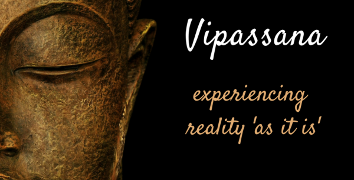
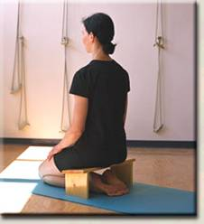

  

      <ul class="nav">
          <li><a href="index.html">blog</a></li>
      </ul>
  

#### Bro! Do you even meditate?

 
 

#### Timetable
4:00 – Wake up

4:30 – 6:30 Meditation in the hall or in your own room

6:30 – 7:30 Breakfast. 6:30 new students, 7:00 old students

7:30 – 8:00 Rest

8:00 – 9:00 Group meditation in the hall

9:00 – 11:00 Meditation in the hall or in your own room according to the teacher instructions

11:00 – 12:00 Lunch. 11:00 new students, 11:30 old students

12:00 – 13:00 Rest

13:00 – 14:30 Meditation in the hall or in your own room

14:30 – 15:30 Group meditation in the hall

15:30 – 17:00 Meditation in the hall or in your own room according to the teacher instructions

17:00 – 17:40 Tea break

18:00 – 19:00 Group meditation in the hall

19:00 – 20:15 Discourse in the hall

20:15  – 21:00 Group meditation in the hall

21:30 Lights out

 
This every single day. Ten days in a row.  A 10 day Vipassana Meditation is work. Hard work.

 
#### Vipassana Meditation
Vipassana means to see things as they really are. It is say that the Vipassana Meditation technique is the closest version to the meditation that Siddhartha Gautama, the Buddha, practiced to reach his enlightenment. The technique is around 2500 years old and was keep alive by teachers generation after generation in the country of Burma.

The technique in its practical side is focus on developing the capacity to perceive all kind of sensations that are always present in the body. Sensations that we almost never get to perceive to its fullest because our capacity of attention is limited.

In the intellectual level the technique teaches that sensations is the bridge between the outside world and how the mind perceives it. By learning to perceive sensations as they appear the individual can gain control on how external events affect the mind.

I do not pretend to describe Vipassana in detail in this post. If you are interested in understanding Vipassana better visit [this page.](https://www.dhamma.org/en-US/index)
 

#### 10 days Vipassana Meditation Retreat
The retreat is offered by an organization founded by S.N. Goenka in different locations around the world.

Main characteristics of the retreat:

- No fees. Participants can make a donation only after successfully completing the course
- Separation of woman and men. There are separated residential areas, dinning rooms and gardens. The only time women and men see each other is during the group meditations and the discourses, and even there the rooms are divided in two areas. Not surprisingly, not having people of the opossite sex around helps a lot to reduce distractions
- Noble silence. This is one of the most challenging elements of the course. Any kind of communication is allowed during the first 9 days, no verbal communication, no gestures, no eye contact. There are many good reasons for this, which I will not mention here. Visit [this link](https://oneminddharma.com/noble-silence/) for a short description
- Only vegetarian food is served
- Participants are expected to help cleaning the entire center at the 10th day
- Questions can be asked to the teacher at specific times during the day
- A bell is ringed to remember students of the timetable. The bell rings at 4 am to start the day activities

#### My experience

The experience in perspective was amazing. It really left an impression on me and made me rethink aspects of my behavior very deeply.

The practice of the noble silence is probably the element of the course that makes it so effective and particular. At the beginning it feels weird to be near to people all the time and don’t interact in absolutely any way. I shared a room with another guy, and after the 10 days when we finally talked to each other felt like if we had not seen each other in a long time.

After a few days I got used to not talking and that really helped me to focus in my practice and to achieve so much progress in my meditation skills.

Another very relevant of the course is the pain. Yes! The pain! There was a lot of that during the first days. Try to sit on the floor with an straight back for 10 hours per day 10 days in a row and you will know what I am talking about.

I started sitting on a meditation bench but it did not well for me and switched on third day to a crossed leg position.  The meditation bench I was using looks like this:

#### Here a day by day summary of the most relevant things I remember from every day.

##### Day 0

I arrived around 18:30. Dinner time finished around 18:00 so I went with an empty stomach to bed.

Noble silence and functioning of the facilities were explained in a short talk around 19:00.

A room is assigned to you and get to talk with your roommate to decide things like if we wanted to close the window at night or not.

##### Day 1

Separation between woman and men starts.

It was easy to wake up.

Started trying with a meditation bench out of a recommendation from a [youtube video](https://www.youtube.com/watch?v=RsBoBSm6dBE&feature=youtu.be) I watched the week before.

A lot of pain in the knees. A lot of noise in the room, people change position very frequently.

##### Day 2

I started using ear plugs to sleep better because birds in the near trees kept singing until around 22:30. I could not listen to the bell and overslept until 4:20.

I had a lot of pain in the knees. I tried combining the bench with cushions but did not work well.

##### Day 3

I woke up on time. I kept using the bench until around midday and then switched to a crossing legs position. That worked much better but produced a constant pain in the back.

##### Day 4

This day I overslept until 6:00, I just did not heard anything and was very tired.

Vipassana technique starts to be explained in a two hour session from 14:00 to 16:00. Before Vipassana is explained the practice consist on focusing the attention on the breath and the sensations in the area between the upper lip and the nostrils.

##### Day 5

I woke up on time.

The pain in the back starts being a problem.

Strong determination sittings start in this day. It is expected that during the group meditations you don’t change position nor leave the room. I actually achieved it almost every time.

##### Day 6

I woke up at 4:20. I feel physically and mentally exhausted as I get out of bed. After breakfast I felt better again.

Serious doubts started to appear in my head, there are five more day to go. I am experiencing strong pain ant the progress is slow.

Nevertheless, I started to understand better the technique and learned to perceive the pain as a sensation and not as a source of suffering.

##### Day 7

I woke up on time. In discourse rebirth and karma starts to be mentioned quite frequently… Doubts appeared in my head about the technique, for moments I felt as if I had just joined a sect.

The group meditations started to be much more quiet. For long sustained period of time the hall full with more than 100 people is in absolute silence. An amazing feeling, the environment is very encouraging and helps to develop the practice.

The doubts about the technique disappeared by the end of the day.

##### Day 8

I woke up on time.

I had a lot of progress. I started to appreciate the power of the technique at the intellectual and experience level.

I had mixed feelings. In one side I wanted to continue my practice and from the other I kind of wanted to go home. I had the felling for moments that it was enough, that I had learned sufficient. I was wrong, there was and there is still a lot to learn.

##### Day 9

Great discourse, it really made sense to me. You can watch it here if you are interested. Emphasis in the not relevance in the acceptance of the religious content. Incredible silence, you feel how everyone is deeply concentrated and not changing position. Amazing feeling

##### Day 10

Noble silence ended at around 11:00. They said the noble silence ends on the 10th day as a way for the participants to get adapted to interact again before you leave the meditation center.

Start talking again was by itself a great experience. It was scary, from one side I kind of wanted to finally communicate with others and from the other I wanted to continue with the noble silence.

##### Day 11

Course finished after breakfast at around 7:00.

Cleaning of the facilities took place and finished at around 9:00 am.

I left around 9:15.

 
#### Some final thoughts
The course is only for those with a serious determination to learn the Vipassana technique of meditation. There is a lot of physical and mental work to be done, be prepared for that.

There is a desertion rate of around 10%. Keep that in mind.

The course has a good dosis of religious content but most of the technique can be understood and accepted letting it out.

I did not just learn to meditate, I learned to perceive with great detail the sensations in my body. I certainly reached states of consciousness that are simply difficult to describe.

In my opinion, every human being should go through an experience like this at least once in their lifetime.